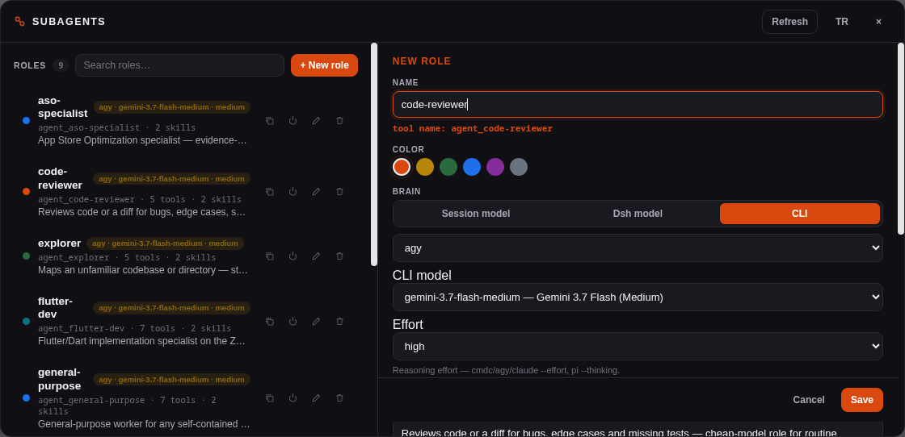

# dsh-subagents


ZCode-style custom subagents for [DeepSeek Harness](https://github.com/deepseek-ai/deepseek-harness) (dsh).



Define reusable roles — a reviewer, a test writer, a docs researcher — as Markdown files.
Each definition becomes a per-role agent tool (`agent_reviewer`, `agent_test_writer`, …)
your primary model delegates to from any normal session. Roles run on their **own model
route** (delegate the routine work to a cheap model while you keep the expensive one) or,
as a dsh-subagents extension, through an **external CLI** (`cmdc`, `pi`, `agy`, `claude`,
`dsh` headless).

```
you (expensive model) ── "have reviewer check this diff"
   └── agent_reviewer  (pinned cheap route or CLI) ─── result returns to your chat
```

## Why

The primary agent is most effective when it stays in its own context and delegates:
routine reviews, lookups and drafts burn tokens and attention on the big model. dsh's
native subagent tool always inherits the calling session's route — it cannot say "run
*this one* on glm-flash". This plugin closes that gap, and goes one step further by
letting a role be a CLI instead of a dsh model.

## How it works

1. Drop definition files under `$DSH_HOME/agents/` (default `~/.dsh/agents/`).
2. Each file registers one model-facing tool. The primary agent picks a role from the
   tool's description — no system-prompt injection, no extra protocol in your chat.
3. dsh resolves tools per LLM request, so **edits hot-reload into the next turn**
   (ZCode requires a new session; dsh-subagents does not).

### Model-backed roles

```markdown
---
name: reviewer
description: Reviews code or a diff for bugs, risks and missing tests.
model: bai/glm-5.3-flash        # omit or "inherit" to follow the session's model
tools: [bash, read, grep]       # optional exhaustive allow-list
disallowedTools: [write]        # …or a deny-list
color: "#d9480f"
---
You are a code review subagent…
```

Foreground by default: several `agent_*` calls in one turn run in parallel and the
results come back as tool results. Pass `run_in_background: true` for a continuable
child whose result arrives later as a notice while you keep working.

### CLI-backed roles (extension)

```markdown
---
name: translator
description: Translates or polishes short texts (TR/EN) through a free external CLI.
cli: agy
cliModel: gemini-3.7-flash-low
cliEffort: low
---
Translate or rewrite the given text as instructed by the task prompt.
```

The role runs the CLI in a shell-less subprocess and the tool call returns its
output — like a bash call with a brain you chose. The definition body is
delivered as the role's system prompt where the CLI supports one.

A CLI role can pin the CLI's own model (`cliModel:`) and reasoning effort
(`cliEffort:`). The manager editor loads both from the live CLI catalog —
pick a model from the list, pick an effort, see them on the role badge.
`dsh` headless is profile-bound and supports neither.

| `cli:`   | headless invocation                                        | model flag    | effort flag     | definition body delivered as |
|----------|------------------------------------------------------------|---------------|-----------------|------------------------------|
| `cmdc`   | `cmdc --no-session -p <task>`                              | `--model`     | `--effort`      | embedded role instructions   |
| `pi`     | `pi --no-session -p <task>`                                | `--model`     | `--thinking`    | `--append-system-prompt`     |
| `agy`    | `agy --disable-slash-commands -p <task>`                   | `--model`     | `--effort`      | embedded role instructions   |
| `claude` | `claude -p <task>`                                         | `--model`     | `--effort`      | `--append-system-prompt`     |
| `dsh`    | `dsh --profile headless <task>`                            | —             | —               | not deliverable (documented) |

CLI roles are always foreground and share a configurable concurrency cap
(`maxConcurrentCli`, default 3). Each CLI must be on `PATH`.

## Role skills

Cheap models cannot be trusted to load a skill before acting. A definition can
therefore name skills, and dsh-subagents resolves them **at spawn time** and
inlines them into the child's persona — deterministic preload, and the calling
session's skill catalog stays untouched:

```markdown
---
name: reviewer
description: Reviews code or a diff for bugs, risks and missing tests.
model: bai/glm-5.3-flash
skills: [subagent-ground-rules]
---
You are a code review subagent…
```

Skill files are plain Markdown (`<name>.md` or `<name>/SKILL.md`; frontmatter
is parsed and stripped). Resolution order: `skillsDirs` entries first (default
`$DSH_HOME/subagent-skills/`), then the plugin-bundled `skills/` — a user copy
overrides a bundled skill. Editing a skill file applies to the very next spawn;
a missing skill logs a warning and the role spawns without it.

### Bundled roster and skills

`examples/` ships a nine-role master roster; `skills/` ships the playbooks
they rely on. Planner and coder specialists run on a stronger route
(`your-provider/strong-model`); scan/review roles on a cheap one
(`bai/glm-5.3-flash`); `general-purpose` inherits the session model. Every
role carries a scoped tool allow-list (including `skill`, so a child can
still load workspace skills at its own discretion) and inlines
`subagent-ground-rules` for a uniform low-model execution protocol.

| Role file | Tool | Route | Skills |
|---|---|---|---|
| `general-purpose.md` | `agent_general_purpose` | inherits session | ground rules, general-purpose-playbook |
| `explorer.md` | `agent_explorer` | cheap model | ground rules, codebase-exploration |
| `aso-specialist.md` | `agent_aso_specialist` | planner model | ground rules, aso-playbook |
| `backend-cloudflare.md` | `agent_backend_cloudflare` | planner model | ground rules, cloudflare-backend-playbook |
| `code-reviewer.md` | `agent_code_reviewer` | cheap model | ground rules, code-review-checklist |
| `flutter-dev.md` | `agent_flutter_dev` | planner model | ground rules, flutter-dev-playbook |
| `orchestrator.md` | `agent_orchestrator` | planner model | ground rules, orchestration-playbook |
| `security-auditor.md` | `agent_security_auditor` | cheap model | ground rules, security-review-checklist |
| `ui-designer.md` | `agent_ui_designer` | cheap model | ground rules, ui-design-playbook |

The `orchestrator` plans and returns an executable assignment plan; the
primary agent then sends the prompts it produces to the other `agent_*`
roles. It does not run the work itself.

## Definition file reference

Markdown with frontmatter; the body is the role's system prompt. Keys are camelCase and
case-sensitive; unknown keys are silently ignored (ZCode parity). A file whose basename
starts with `_` is disabled.

| Key                | Description                                                                 |
|--------------------|-----------------------------------------------------------------------------|
| `name`             | Required. Identifier; the tool becomes `agent_<name>` (slugified).          |
| `description`      | Required. When the primary agent should pick this role — be specific.       |
| `model`            | `provider/model`, or `inherit` / omitted to follow the calling session.     |
| `cli`              | Run through an external CLI instead of a dsh model. Mutually exclusive with `model`. |
| `cliModel`         | The CLI's own model id, passed via its `--model` flag. Requires `cli`. |
| `cliEffort`        | Reasoning effort (`low` / `medium` / `high`, plus CLI-specific extras). Requires `cli`. |
| `tools`            | Exhaustive allow-list of tool names (omit for all). Unknown names are dropped with a warning; an allow-list matching nothing fails the call loudly. |
| `disallowedTools`  | Deny-list of tool names.                                                    |
| `skills`           | Role skill names (see [Role skills](#role-skills)) — resolved and inlined into the persona at spawn time. |
| `color`            | Identity marker (informational).                                            |

ZCode keys with no dsh-runtime counterpart (`thoughtLevel`, `maxTurns`, `injectAgentsMd`,
`mcpServers`) are ignored — see [Differences from ZCode](#differences-from-zcode).

## Install

```sh
dsh plugin --profile web add link:/path/to/dsh-subagents
supervisorctl restart dsh-web        # host half loads at boot; sessions drop
bash scripts/install-roster.sh       # roles → ~/.dsh/agents, skills → ~/.dsh/subagent-skills
```

Or install from npm when published: `dsh plugin --profile web add dsh-subagents`.

`link:` installs need the plugin's `node_modules/@deepseek-ai/<peer>` entries to resolve
to the profile's packages (`dsh-tools`, `cordis`, `dsh-llm`); see
[dsh runbook](https://github.com/deepseek-ai/deepseek-harness) notes on linked plugins.

## Configuration (`cordis.patch.yml`)

| Key                | Default            | Description                              |
|--------------------|--------------------|------------------------------------------|
| `agentsDir`        | `$DSH_HOME/agents` | Where definition files live.             |
| `provider`         | `spawn`            | Continuable subagent provider.           |
| `cliTimeoutMs`     | `300000`           | CLI subprocess timeout.                  |
| `modelTimeoutMs`   | `600000`           | Headroom for model-backed tool calls.    |
| `maxOutputChars`   | `12000`            | Output cap returned to the calling agent.|
| `maxConcurrentCli` | `3`                | Concurrent CLI-backed executions cap.    |
| `rescanMs`         | `15000`            | Rescan interval (hot-reload safety net). |

## Operations

A sidebar launcher opens the **Subagents manager**: a roles list plus a
ZCode-style New/Edit editor. Pick the role's brain from the live dsh model
catalog (a cheap route for routine work) or a CLI — CLI roles load that
CLI's live model list and effort levels automatically — choose its tool
allow-list and system prompt, and see the definition file as you type.
Roles can be created, edited, disabled and deleted entirely from the UI —
files under `$DSH_HOME/agents/` remain the source of truth. In a dsh
session, the `/agents` slash command lists the same roles.

```sh
node --test                     # unit tests
bash scripts/smoke.sh           # tests + live debug route (default 127.0.0.1:3080)
curl -s localhost:3080/plugins/dsh-subagents/debug   # roles, tools, diagnostics
```

The debug route lists loaded roles, registered `agent_*` tools and per-file diagnostics
(missing keys, bad routes, duplicates). Host-half changes need a `dsh-web` restart;
definition-file changes do not.

## Architecture decisions

- **No system-prompt sections.** Discovery happens through per-role tool
  descriptions. Your chat carries zero extra protocol; only the roles you
  define exist as tools.
- **Registration anchoring.** In the verified dsh composition, a tool
  registration made inside the plugin's apply fiber is rolled back when that
  fiber ends, while native timers, file-watch callbacks and HTTP handlers
  anchor registrations durably. The rescan interval therefore doubles as a
  self-heal loop: `lib/reconcile.js` re-makes any registration the registry no
  longer shows. If a future dsh release changes this fiber behavior, the
  interval simply becomes a no-op.
- **Pure core.** Frontmatter parsing, argv building and reconciliation are
  dependency-free pure modules with unit tests; only `lib/index.js` touches
  cordis/dsh services.
- **Frontmatter is a practical YAML subset** (scalars, quoted values, inline
  and block lists, `|`/`>` block scalars). No nested structures by design.

## Differences from ZCode

- **CLI-backed roles** — a role can be an external CLI, not just a dsh model.
- **Hot reload** — definition edits apply to the next turn; ZCode needs a new session.
- **No Settings UI** — files are the source of truth (rename with a `_` prefix to
  disable). A settings panel is a welcome contribution.
- `thoughtLevel`, `maxTurns`, `injectAgentsMd` and `mcpServers` have no dsh-runtime
  counterpart yet and are ignored.
- Subagents inherit the session's tool registry (including connected MCP tools);
  allow/deny lists are enforced host-side per spawn.
- **User-level only.** Workspace/project-level agent directories are deliberately
  out of scope for now: dsh tools register globally, so a workspace-scoped role
  would either leak into other workspaces or need per-agent registration the
  current runtime does not expose. A future runtime API may unlock this safely.

## Development

```sh
node --test                 # parser, argv map, sanitization
node --check lib/*.js
```

Layout: `lib/definitions.js` (frontmatter + validation), `lib/runner.js` (model/CLI
execution), `lib/index.js` (tool registration, hot reload, debug route). Verified
against dsh `0.1.1-rc.2`; re-run the smoke after upgrading dsh.

## Changelog

See [CHANGELOG.md](CHANGELOG.md).

## License

[MIT](LICENSE)
